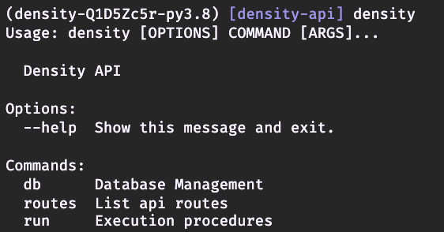

# density-api

# [Homework Repo](https://github.com/DensityCo/api-homework)

Create an API that can handle:

1. **historical** people count requests from consumers.
2. **real-time** people count requests from consumers.

Your task is to accomplish the following:

- Scaffold a **database** structure that includes:
  - spaces
  - doorways
  - count data
- Document how you would store and return real-time count for spaces.
- Document how you would store and return historical count for spaces.
- Prototype an API endpoint that yields the current count of a given space at a given point in time.
- Describe the technologies you would use in production to handle this workload at scale (100,000 DPUs).

Items to take into consideration:

- DPUs are sometimes moved from one doorway to another.
- DPUs sometimes send events out of order.
- DPUs don't always send data up in real-time. Network downtime and other events can cause delayed events.

# About

This is a project implementing an API to store and serve people counts measured by
Density Processing Units for consumer applications. The API is built in Python using
FastAPI as the web framework and is backed by a TimescaleDB Postgres database.

My efforts emphazied a stout and flexible API implementation. A majority of the Python code was
repurposed from my previous projects and adapted to this use case, tests included.

The part of the implementation left most wanting is the database design. How I chose
to distinguish readings from DPUs on internal/internal thresholds (DPU 423) vs those
on internal/external thresholds (DPU 283) served its intended purpose of enabling
the API to "infer" the people count of internal spaces (Space B), but came out clunky
and mashed together. It isn't a schema design that I would try to scale this API on.
Additionally, I didn't make it around to adding continous aggregates to tabulate per space
counts across predefined time intervals, which would have facilitated serving up aggregated
count data with much lower compute overhead at query time.

<br/>

#### [The original requirements for this project can be found here](https://github.com/DensityCo/api-homework).

Density Processing Units, or DPUs, are sensors mounted above doorways. The DPU sends a request to the API when a person passes underneath (+1 when towards the DPU, -1 when walking away from the DPU).


<br/>

<br/>

# Usage & Development

##### Required tools:

- Python >=3.8.0
- [Poetry Package Manager](https://python-poetry.org/docs/#installation)
- Docker

##### Optional tools:

- jq `brew install jq`
- make `brew install make`
- httpie `brew install httpie`

### Environment

Environment variables can either be defined at the system level or in a filed named '.env' in the project's root directory.

Example .env file for local development:

```sh
# .env
PYTHONPATH=./:./src/density:./src:${PYTHONPATH}

ENV=development

DATABASE_NAME=density
DATABASE_USERNAME=density
DATABASE_PASSWORD=password
DATABASE_HOST=0.0.0.0
DATABASE_PORT=5432

LOG_LEVEL=20
LOG_FORMAT=simple
DEBUG=false
SECRET_KEY=local

# for timescaledb container
POSTGRES_USER=density
POSTGRES_PASSWORD=password

```

## Installation

1. Install Poetry: `pip3 install poetry`
2. Install the project dependencies defined in [pyproject.toml](pyproject.toml): `poetry install`
3. Source your .env file if your IDE/terminal doesn't do so automatically: `source .env`
4. **Optional (Recommended)**: Populate the database with the provided [sample data](docs/dpu_data.csv): `poetry run seed_db`
5. Launch the application and its supporting database: `docker-compose up`

- If you need to startover with a clean database, you can generate a fresh one by
  running `make recreate-and-seed-db`.

### Commands

Several frequently needed and useful commands are captured in the [Makefile](Makefile).

### CLI Reference

You can verify you have installed the project by running:

```sh
density --help
```



<br/>

If you get an error saying the app can't be found, make sure the Poetry virtual
environment is active (`poetry shell`)

<br/>

##### Commands

```sh
# Application Control Commands
density run dev
density run web
```

```sh
# Information Display Commands
density routes
```

```sh
# Database Management Commands
density db downgrade
density db migrate
density db recreate
density db upgrade
```

<br/>
<br/>

### API

The API documentation is viewable at http://0.0.0.0:8000/docs when the app
container is running.

You can verify the API is available by checking the health endpoint:

```sh
curl http://0.0.0.0:8000/api/v1/health
```

<br/>

#### Example Requests:

All examples below will use HTTPie.

<br/>
Get the most current people count for a specific space:
```sh
http :8000/api/v1/counts/1/current --follow
```

<br/>
Fetch all historical counts for a specific space:
```sh
http :8000/api/v1/counts/1 --follow
```

<br/>
Fetch historical counts over a time interval:
```sh
http :8000/api/v1/counts filter=="timestamp>'2018-02-25' and timestamp<'2018-02-26'" --follow
```

<br/>
Create a new reading:
```sh
http POST :8000/api/v1/readings/ dpu_id=423 timestamp="2019-08-24T14:15:22Z" direction=-1 --follow
```

<br/>
List DPUs:
```sh
http :8000/api/v1/dpus --follow
```

<br/>

##### Available Endpoints

| name                   | url path                          | methods         |
| ---------------------- | --------------------------------- | --------------- |
| openapi                | /api/v1/openapi.json              | {'GET', 'HEAD'} |
| swagger_ui_html        | /swagger                          | {'GET', 'HEAD'} |
| redoc_html             | /docs                             | {'GET', 'HEAD'} |
| health                 | /api/v1/health                    | {'GET'}         |
| create_space           | /api/v1/spaces/                   | {'POST'}        |
| list_spaces            | /api/v1/spaces/                   | {'GET'}         |
| retrieve_space         | /api/v1/spaces/{id}               | {'GET'}         |
| update_space_full      | /api/v1/spaces/{id}               | {'PUT'}         |
| update_space_partial   | /api/v1/spaces/{id}               | {'PATCH'}       |
| delete_space           | /api/v1/spaces/{id}               | {'DELETE'}      |
| create_doorway         | /api/v1/doorways/                 | {'POST'}        |
| list_doorways          | /api/v1/doorways/                 | {'GET'}         |
| retrieve_doorway       | /api/v1/doorways/{id}             | {'GET'}         |
| update_doorway_full    | /api/v1/doorways/{id}             | {'PUT'}         |
| update_doorway_partial | /api/v1/doorways/{id}             | {'PATCH'}       |
| delete_doorway         | /api/v1/doorways/{id}             | {'DELETE'}      |
| create_dpu             | /api/v1/dpus/                     | {'POST'}        |
| list_dpus              | /api/v1/dpus/                     | {'GET'}         |
| retrieve_dpu           | /api/v1/dpus/{id}                 | {'GET'}         |
| update_dpu_full        | /api/v1/dpus/{id}                 | {'PUT'}         |
| update_dpu_partial     | /api/v1/dpus/{id}                 | {'PATCH'}       |
| delete_dpu             | /api/v1/dpus/{id}                 | {'DELETE'}      |
| create_reading         | /api/v1/readings/                 | {'POST'}        |
| list_readings          | /api/v1/readings/                 | {'GET'}         |
| retrieve_reading       | /api/v1/readings/{id}             | {'GET'}         |
| list_counts            | /api/v1/counts/                   | {'GET'}         |
| list_counts_by_space   | /api/v1/counts/{space_id}         | {'GET'}         |
| current_space_count    | /api/v1/counts/{space_id}/current | {'GET'}         |

### Database Schema

The database schema is managed by the application through a combination of SQLAlchemy
and Alembic. The schema migrations produced by Alembic can be found [here](src/density/db/migrations/versions).

For reference, an export of the raw SQL DDL can be found [here](scripts/schema-export.pgsql).

<br/>

The application's data is stored in four primary tables:

- **spaces**: rooms, buildings, or other enclosures monitored by DPUs
  - spaces can have one or more doors
- **doorways**: an entity representing a threshold over which a DPU is mounted. Doorway records
  are associated to two spaces:
  - An "ingress" space: the inner space demarcated by DPUs (corresponds to +1 readings)
  - An "egress" space: the opposite, or "outside", space (corresponds to -1 readings).
    - An empty egress space indicates the outer boundary of the spaces monitored by DPUs.
    - **A non-null egress space indicates traffic across this threshold can be used for inferring the
      people count of internal spaces interior to the space monitored by the DPU mounted to this threshold.**
- **dpus**: Distinct Density Processing Units
- **readings**: measurements sent by DPUs

and three views:

- **direct_space_counts**: aggregate people counts over time for spaces with sensors installed (Space A in the given example)
- **inferred_space_counts**: aggregate people counts over time for internal spaces adjacent to spaces with sensors installed (Space B in the given example)
- **space_counts**: union of the two preceeding views

<br/>

<br/>

# Next Steps

### Production Configuration (100,000 DPUs)

#### Ingest Pipeline

Below is a high-level outline of how I would implement an ingestion pipeline
to support this API in a scaled production environment.

1. Ingest with AWS IoT or Kinesis Data Stream directly

   - Somewhat dependent on constraints of use case:
     - Capabilities of embedded software
     - Messaging protocol (HTTP/MQTT)
     - Is remote device management required?
     - Need to stream to clients in near real time?
     - Need fast playback?
     - Other architectural considerations

2. Stream to Kinesis Firehose

- Buffer inbound messages by cumulative size and time interval
  - e.g. 3MiB or 60 seconds, whichever comes first
- Backup source records to S3
- Transform with Lambda function(s)
- Optional: Backup transformed records to S3
- Deliver to SNS topic, or directly to SQS queues

3. Persist to database with Lambdas listening to SQS queues

#### Serving the API

Below are a few options describing how this API could be deployed to an AWS
environment on an architecture that is scalable and highly available.

1. Container Orchestrator running on Spot instances

- ECS, Beanstalk, and EKS are the sensible options. Without other context, I would
  choose to run this on an ECS cluster. ECS is a good selection for general use cases.
  It contributes FAR less operational overhead than EKS, and has more granular
  controls and flexibility than Beanstalk.

- Cluster autoscaling configuration would likely perform most effeciently using CPU
  utilization % as the scalable dimension. The use case implies traffic patterns would
  tend toward regular and somewhat predictable, with changes in demand occuring on smoother,
  rather than steeper, gradients. Given that assumption, a conservative CPU utilization
  threshold paired with a step scaling policy on a middling-duration cooldown (e.g. 5-10 minutes)
  would optimize for cost by hedging against over provisioning. Alternatively, if sudden,
  large swings in demand were typical, or if responsiveness was priority #1, I'd opt
  for a target tracking policy that would scale the cluster proportional to the delta
  of the scalable dimension.

- Since there is no need for local state storage, Spot instances would be leveraged as much
  as possible due to the significant cost savings. Service disruption due to instance interruption
  can be managed by configuring the cluster to provision hosts from a variety of instance sizes,
  availability zones, and price points. The cluster can also be configured to maintain an
  arbitrary percentage of its hosts as on-demand or reserved instances.

2. Lambda Serverless Functions

- Serverless has the benefits of seamless scalability and durability. This type of solution
  could readily be deployed and maintained successfully on a serverless architecture; however,
  serverless wouldn't be my first choice for this use case for the following reasons:

  1. Generally speaking, the cost stucture of serverless makes it optimal at smaller scales
     and lower frequencies, while the inverse is true of instanced compute.

  2. The traffic pattern of this use case at scale is most likely one of near-constant inflow.
     That steady, on-going use of compute time is typically antithetical a serverless use case,
     primarily from a cost perspective.

  3. When building for serverless, applications become exponentially more difficult to develop
     and maintain as the size and complexity of the project grow. This is in part a result of
     the tooling not quite being there yet, and the other part is attributable to it just being
     a different architectural paradigm that requires a different mental model to reason about
     effectively. If this project was anticipated to stay small and focused on its use case,
     this point would be moot.

- An alternative framework to consider in the serverless context is [Chalice](https://github.com/aws/chalice).
  It is especially useful for smaller applications that benefit from tight integrations with
  other AWS services.

#### Data Storage

Data would be stored in a Postgres+TimescaleDB. The high insert rate, flexible partitioning,
real-time continuous aggregates, and syntactic familiarity make Timescale a perfect fit,
especially so given the append only nature of this problem domain.

Hosting options are the real question of the hour with Timescale. The answer to which is
contingent upon your budget, on-staff expertise, and appetite for devops. Assuming this
solution would be deployed in AWS, three options are available:

1. Use Timescale's fully managed cloud offering. It is pricey, as managed solutions
   always are, but it pales in comparison to the value added by focusing dev resources
   on the product. VPC peering for secure networking between the managed instances and
   your production VPC is easy to implement and cost effective compared to other options.

2. Self host on EC2. This requires substantial internal effort to achieve HA and protect
   against data loss, but it will also come out as the most cost effective at sufficient
   scale in the long term.

3. Leverage a Timescale hosting service in another public cloud (e.g. DigitalOcean).
   This option adds several additional points of failure, on top of the cognitive overhead
   of operating in two clouds. There is also a big hidden cost here in the egress data transfer
   across the BGP tunnel between clouds, on top of the costs of the tunnel itself. Multi-cloud
   is almost always a decision that comes back to bite you.

#### Secrets Management

This is mostly just a bonus because I think it's cool and super useful.

Securely managing secrets in a production environment is a high priority. An effective
and transparent way to do it when deploying to AWS is to use their Parameter Store
service. AWS' Parameter Store is essentially a distributed, highly available key-value
store, access to which can be controlled using IAM roles. It is also dirt cheap.

A transparent way to take advantage of it is to bake a tool like [Chamber](https://github.com/segmentio/chamber)
into the container (or serverless function) executing the runtime. Then it is just a
matter of invoking Chamber in the during container startup, which injects the secrets
from the Parameter Store into the container's environment variables, subject to the
permissions of the IAM role in use by the container.

## Notes on Next Steps

Below are some general thoughts

#### API Improvements

- Endpoints for batch posting. Would help avoid stampedes when sensors transmit
  backlogged history when reconnecting from an offline state.
- Response Caching: ideally at the gateway level
- Implement Auth: OAuth2 flow dependent upon targeted clients

#### Database Improvements

- Implement support for moving sensors while maintaining integrity of historical readings.
- Add Row Level Security / Row Ownership
- More intuitive handling and storage of spaces with inferred counts
- Leverage continous aggregates to tabulate per space counts by predefined time intervals.
- I am wholly confident there is at least one glaringly obvious index that is missing.

#### Other Improvements

- CI/CD
- Test coverage to >= 99% (currently at ~96%)

<br />
<br />
<br />

Thanks!
